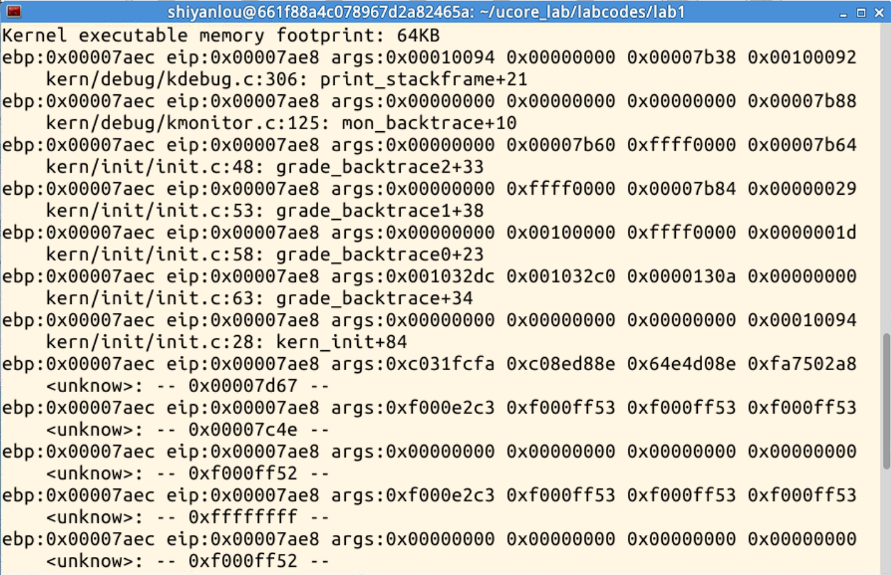
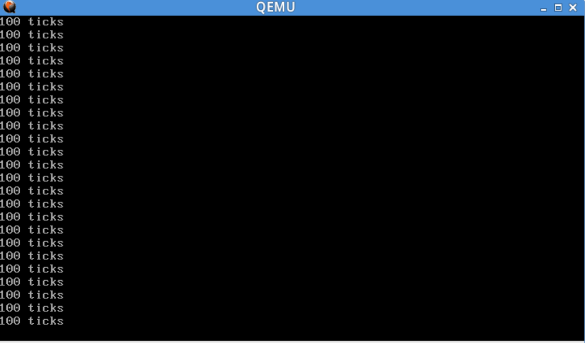

# Lab1 Report

***
## 练习4
阅读代码bootmain.c

**bootloader如何读取硬盘扇区：**

bootloader采用PIO的方式从硬盘中读取内核所在的各个扇区。首先，PIO操作相关的IO地址寄存器一共有8个，地址通常为`0x1F0~0x1F7`，具体对应关系如下：

| IO地址   | 功能              | 描述          |
| ---- | --------------- | ----------- |
| 0x1F0    | 数据端口            | 读取/写入数据     |
| 0x1F2    | 扇区数量            | 读取或者写入的扇区数量 |
| 0x1F3    | 扇区号/ LBA低字节     |             |
| 0x1F4    | 柱面号低字节/ LBA中字节  |             |
| 0x1F5    | 柱面号高字节 / LBA高字节 |             |
| 0x1F6    | 驱动器号            |             |
| 0x1F7    | 命令端口 / 状态端口     | 发送命令或者读取状态  |

`readsect`函数：
```c
/* 
readsect - read a single sector at @secno into @dst 
从@secno读取一个扇区到@dst
*/
static void
readsect(void *dst, uint32_t secno) {
    // wait for disk to be ready 等待磁盘空闲
    waitdisk();

    outb(0x1F2, 1);             // count = 1，读取一个扇区
    outb(0x1F3, secno & 0xFF);      //0-7位扇区号/ LBA0-7位低字节
    outb(0x1F4, (secno >> 8) & 0xFF);   //8-15位柱面号低字节/ LBA8-15位中字节
    outb(0x1F5, (secno >> 16) & 0xFF);    //16-23位柱面号高字节/ LBA16-23位高字节
    outb(0x1F6, ((secno >> 24) & 0xF) | 0xE0);  //LBA24-27位
    /*
    前24+4=28位为偏移量，即第0-27位
    第28位为0，访问Disk0主盘
    29-31位为1
    */
    outb(0x1F7, 0x20);                      // cmd 0x20 - read sectors ，发送读取扇区的命令

    // wait for disk to be ready   等待磁盘读取完毕
    waitdisk();

    // read a sector
    insl(0x1F0, dst, SECTSIZE / 4);    //读取到dst的位置，SECTSIZE/4因为单位为字(DW)
}
```
使用到的函数：
`static inline void outb(int port, uint8_t data)`：
参数说明：
- `port`：要写入的 I/O 端口地址。
- `data`：要写入的字节数据。

`static inline void insl(int port, void *addr, int cnt)`：
参数说明：
- `port`：要读取的 I/O 端口地址。
- `addr`：存储读取数据的缓冲区地址。
- `cnt`：要读取的双字数据的数量。

再看`readseg`函数：
```c
/* *
 * readseg - read @count bytes at @offset from kernel into virtual address @va,
 * might copy more than asked. 从@offset处读取count个字节到@dst
 * */
static void
readseg(uintptr_t va, uint32_t count, uint32_t offset) {
    uintptr_t end_va = va + count;

    // round down to sector boundary
    va -= offset % SECTSIZE;

    // translate from bytes to sectors; kernel starts at sector 1 //将偏移量转换为扇区号，ELF文件从扇区1开始，0扇区被引导占用
    uint32_t secno = (offset / SECTSIZE) + 1;

    // If this is too slow, we could read lots of sectors at a time.
    // We'd write more to memory than asked, but it doesn't matter --
    // we load in increasing order.
    for (; va < end_va; va += SECTSIZE, secno ++) {
        readsect((void *)va, secno);
    }//由于按扇区读入，实际读入的字节数多于count，但多读入的字节没有影响
}
```

**bootloader是如何加载ELF格式的OS：**

`bootmain`函数：
```c
/* bootmain - the entry of bootloader */
void
bootmain(void) {
    // read the 1st page off disk 从扇区1开始读取ELF的头部，一共读入8个扇区
    readseg((uintptr_t)ELFHDR, SECTSIZE * 8, 0);

    // is this a valid ELF? 通过ELF头部的e_magic判断ELF文件是否合法
    if (ELFHDR->e_magic != ELF_MAGIC) {
        goto bad;
    }

    struct proghdr *ph, *eph;

    // load each program segment (ignores ph flags)
    //先加载描述表（描述哪里的程序段分别应该加载多少字节，加载到内存的哪些位置
    ph = (struct proghdr *)((uintptr_t)ELFHDR + ELFHDR->e_phoff);
    eph = ph + ELFHDR->e_phnum;
    for (; ph < eph; ph ++) {
        readseg(ph->p_va & 0xFFFFFF, ph->p_memsz, ph->p_offset);
    }//使用readseg函数加载

    // call the entry point from the ELF header
    // note: does not return
    //从ELF头部的e_entry找到内核入口并以函数方式调用
    ((void (*)(void))(ELFHDR->e_entry & 0xFFFFFF))();

bad:
    outw(0x8A00, 0x8A00);
    outw(0x8A00, 0x8E00);

    /* do nothing */
    while (1);
}
```
bootloader从磁盘读取8个扇区到内存中，然后检查是否为有效的ELF文件，如果有效，那么根据ELF头中的描述表，将所有的程序段读取到描述表中指定的内存偏移地址中。当内核文件加载完毕之后，程序将ELF中的入口偏移地址视为函数指针进行调用，实现向内核的调转。

***
## 练习5

**实现函数调用堆栈跟踪函数：**

参照实验指导书中**函数堆栈**一节：
一个函数调用动作可分解为：零到多个PUSH指令（用于参数入栈），一个CALL指令。CALL指令内部其实还暗含了一个将返回地址（即CALL指令下一条指令的地址）压栈的动作（由硬件完成）。几乎所有本地编译器都会在每个函数体之前插入类似如下的汇编指令：
```
pushl   %ebp
movl   %esp , %ebp
```
这样在程序执行到一个函数的实际指令前，已经有以下数据顺序入栈：参数、返回地址、ebp寄存器。由此得到类似如下的栈结构（参数入栈顺序跟调用方式有关，这里以C语言默认的CDECL为例）：

|  栈底方向        | 高位地址
| ---- | ---------------
|    ...        |
|    ...        |
|  参数3        |
|  参数2        |
|  参数1        |
|  返回地址        |
|  上一层[ebp]    | <-------- [ebp]
|  局部变量        |  低位地址


这两条汇编指令的含义是：
首先将`ebp`寄存器入栈，然后将栈顶指针`esp`赋值给`ebp`。`mov ebp esp`这条指令表面上看是用`esp`覆盖`ebp`原来的值，其实不然。因为给`ebp`赋值之前，原`ebp`值已经被压栈（位于栈顶），而新的`ebp`又恰恰指向栈顶。此时`ebp`寄存器就已经处于一个非常重要的地位，该寄存器中存储着栈中的一个地址（原`ebp`入栈后的栈顶），从该地址为基准，向上（栈底方向）能获取返回地址、参数值，向下（栈顶方向）能获取函数局部变量值，而该地址处又存储着上一层函数调用时的`ebp`值。

一般而言，`ss:[ebp+4]`处为返回地址，`ss:[ebp+8]`处为第一个参数值（最后一个入栈的参数值，此处假设其占用4字节内存），ss:[ebp-4]处为第一个局部变量，ss:[ebp]处为上一层ebp值。由于`ebp`中的地址处总是“上一层函数调用时的`ebp`值”，而在每一层函数调用中，都能通过当时的`ebp`值“向上（栈底方向）”能获取返回地址、参数值，“向下（栈顶方向）”能获取函数局部变量值。如此形成递归，直至到达栈底。这就是函数调用栈。

将栈中数据读出：
```c
void
print_stackframe(void) {
    uint32_t ebp = read_ebp();
    uint32_t eip = read_eip();
    int i,j;
    for (i = 0; i < STACKFRAME_DEPTH; i++) {
        cprintf("ebp:0x%08x eip:0x%08x args:", ebp, eip);
        for (j = 0; j < 4; j++)
            cprintf("0x%08x ", (((uint32_t *)ebp)+2)[j]);
        cprintf("\n");
        print_debuginfo(eip-1);
        eip = *(((uint32_t *)ebp)+1);
        ebp = *((uint32_t *)ebp);
    }
}
```
执行`make qemu`后，在qemu模拟器中得到如下输出：


***
## 练习6

### 6.1 
**中断向量表中一个表项占多少字节？其中哪几位代表中断处理代码的入口？**

终端描述符的结构体定义在`mmu.h`中：
```c
struct gatedesc {
    unsigned gd_off_15_0 : 16;        // low 16 bits of offset in segment
    unsigned gd_ss : 16;            // segment selector
    unsigned gd_args : 5;            // # args, 0 for interrupt/trap gates
    unsigned gd_rsv1 : 3;            // reserved(should be zero I guess)
    unsigned gd_type : 4;            // type(STS_{TG,IG32,TG32})
    unsigned gd_s : 1;                // must be 0 (system)
    unsigned gd_dpl : 2;            // descriptor(meaning new) privilege level
    unsigned gd_p : 1;                // Present
    unsigned gd_off_31_16 : 16;        // high bits of offset in segment
};
```
占用64位，也就是8字节，中断处理代码的入口由`offset`和`ss`指定。
其中2-3字节是`ss`，0-1字节和6-7字节拼成`offset`，两者联合便是中断处理程序的入口地址。

### 6.2 
**编程完善kern/trap/trap.c中对中断向量表进行初始化的函数idt_init。在idt_init函数中，依次对所有中断入口进行初始化。使用mmu.h中的SETGATE宏，填充idt数组内容。每个中断的入口由tools/vectors.c生成，使用trap.c中声明的vectors数组即可。**

除了系统调用中断(T_SYSCALL)使用陷阱门描述符且权限为用户态权限以外，其它中断均使用特权级(DPL)为0的中断门描述符，权限为内核态权限。
```c
void idt_init(void) {
    extern uintptr_t __vectors[];
    int i;
    for (i = 0; i < sizeof(idt) / sizeof(struct gatedesc); i++)
        SETGATE(idt[i], 0, GD_KTEXT, __vectors[i], DPL_KERNEL);
    SETGATE(idt[T_SYSCALL], 1, GD_KTEXT, __vectors[T_SYSCALL], DPL_USER);
    lidt(&idt_pd);
}
```
`SETGATE`宏：
```c
#define SETGATE(gate, istrap, sel, off, dpl) {               \
        (gate).gd_off_15_0 = (uint32_t)(off) & 0xffff;      \
        (gate).gd_ss = (sel);                                \
        (gate).gd_args = 0;                                 \
        (gate).gd_rsv1 = 0;                                 \
        (gate).gd_type = (istrap) ? STS_TG32 : STS_IG32;    \
        (gate).gd_s = 0;                                    \
        (gate).gd_dpl = (dpl);                              \
        (gate).gd_p = 1;                                    \
        (gate).gd_off_31_16 = (uint32_t)(off) >> 16;        \
    }
```
```c
#define SEG_KTEXT    1
#define GD_KTEXT    ((SEG_KTEXT) << 3)        // kernel text`
#define DPL_KERNEL    (0)
#define DPL_USER    (3)
```

### 6.3 
**编程完善trap.c中的中断处理函数trap，在对时钟中断进行处理的部分填写trap函数中处理时钟中断的部分，使操作系统每遇到100次时钟中断后，调用print_ticks子程序，向屏幕上打印一行文字”100 ticks”。**

```c
static int tick_count = 0;

static void trap_dispatch(struct trapframe *tf) {

    case IRQ_OFFSET + IRQ_TIMER:
        tick_count++;
	    if (tick_count==TICK_NUM) {
	        tick_count-=TICK_NUM;//100次中断后重置计数器
	        print_ticks();
	    }
	    break;
}
```



***