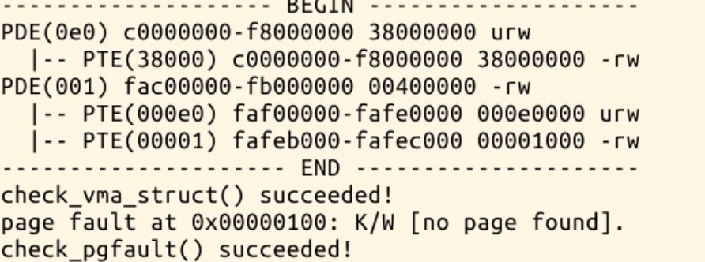
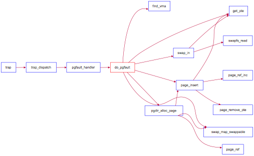
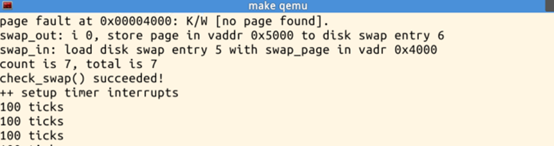

# Lab3 Report

***
## 练习1

**给未被映射的地址映射上物理页：**

先检查页表中是否有该地址对应的表项。若表项为空则未被映射。
对未被映射的地址，使用`pgdir_alloc_page`函数为页目录分配一个物理页框。
```c
    ptep = get_pte(mm->pgdir, addr, 1);
    if(ptep == NULL) {
        cprintf("get_pte failed\n");
        goto failed;
    }
    if (*ptep == 0) {
        struct Page *page = pgdir_alloc_page(mm->pgdir, addr, perm);
        if (page == NULL){
            cprintf("pgdir_alloc_page failed\n");
            goto failed;            
        }
    }
```
使用到的函数：
`pte_t *get_pte(pde_t *pgdir, uintptr_t la, bool create)`：
用于查询给定线性地址`la`对应的 PTE。参数`pgdir`是页目录的基地址，`create`参数指示是否在查询时创建缺失的页表项。
`int pgdir_alloc_page(pde_t *pgdir, uintptr_t la, uint32_t perm)`：
其中，`pgdir`是页目录的基址指针，`la`是要进行映射的线性地址，`perm`是页表项的权限标志。
函数的返回值为整数类型，表示分配的物理页框的物理地址。

经验证，能够通过`check_pgfault`函数的测试。

- Q1. 请描述页目录项（Page Directory Entry）和页表项（Page Table Entry）中组成部分对ucore实现页替换算法的潜在用处。

    `PTE_A`表示是否被访问，`PTE_D`表示是否被修改，对Clock算法、Enhanced Clock算法和LRU算法有潜在用处。

- Q2. 如果ucore的缺页服务例程在执行过程中访问内存，出现了页访问异常，请问硬件要做哪些事情？
    
    硬件将引发页访问异常的地址保存在cr2寄存器中，设置错误代码，然后触发Page Fault异常。

***
## 练习2

**补充完成基于FIFO的页面替换算法：**

如果PTE存在，那么说明这一页已被映射但是被保存在磁盘中，需要将这一页内存交换出来。
根据
    
    先调用`swap_in`将内存页从磁盘中载入内存；
    调用`page_insert`建立物理地址与线性地址之间的映射；
    设置页对应的虚拟地址，方便交换出内存时将正确的内存数据保存在正确的磁盘位置；
    调用`swap_map_swappable`将物理页框加入FIFO。

`do_pgfault`函数：
```c
        if(swap_init_ok) {
            struct Page *page = NULL;
            //(1）According to the mm AND addr, try to load the content of right disk page
            //    into the memory which page managed.
            swap_in(mm, addr, &page);
            //(2) According to the mm, addr AND page, setup the map of phy addr <---> logical addr
            page_insert(mm->pgdir, page, addr, perm);
            //(3) make the page swappable.
            page->pra_vaddr = addr;
            swap_map_swappable(mm, addr, page, 0);
        }
        else {
            cprintf("no swap_init_ok but ptep is %x, failed\n",*ptep);
            goto failed;
        }
```
使用到的函数：
`int swap_in(struct mm_struct *mm, uintptr_t addr, struct Page **ptr_result)`：
参数说明：
- `mm`：指向进程的内存管理结构`mm_struct`的指针。
- `addr`：要换入页面的虚拟地址。
- `ptr_result`：指向指针的指针，用于返回换入的页面的`struct Page`结构。

`int page_insert(pde_t *pgdir, struct Page *page, uintptr_t la, uint32_t perm)`：
参数说明：
- `pgdir`：页目录的基址指针。
- `page`：要插入的页面的 struct Page 结构指针。
- `la`：要插入的线性地址。
- `perm`：页表项的权限标志。

`int swap_map_swappable(struct mm_struct *mm, uintptr_t addr, struct Page *page, int swap_in)`：
参数说明：
- `mm`：指向进程的内存管理结构 mm_struct 的指针。
- `addr`：页面的虚拟地址。
- `page`：要标记为可交换的页面的 struct Page 结构指针。
- `swap_in`：表示是否将页面换入到物理内存的标志，非零值表示需要换入。

```c
static int
_fifo_map_swappable(struct mm_struct *mm, uintptr_t addr, struct Page *page, int swap_in)
{
    list_entry_t *head=(list_entry_t*) mm->sm_priv;
    list_entry_t *entry=&(page->pra_page_link);
 
    assert(entry != NULL && head != NULL);
    //record the page access situlation
    /*LAB3 EXERCISE 2: YOUR CODE*/ 
    //(1)link the most recent arrival page at the back of the pra_list_head qeueue.
    list_add_before(head, entry);
    return 0;
}
```
将最近被用到的页面添加到算法所维护的次序队列，由page fault触发，每次都在表头加入新的page

```c
static int
_fifo_swap_out_victim(struct mm_struct *mm, struct Page ** ptr_page, int in_tick)
{
     list_entry_t *head=(list_entry_t*) mm->sm_priv;
         assert(head != NULL);
     assert(in_tick==0);
     /* Select the victim */
     /*LAB3 EXERCISE 2: YOUR CODE*/ 
     //(1)  unlink the  earliest arrival page in front of pra_list_head qeueue
     //(2)  set the addr of addr of this page to ptr_page
     list_entry_t *victim = list_next(head);
     list_del(victim);
     *ptr_page = le2page(victim, pra_page_link);
     return 0;
}
```
换出的策略，FIFO换出最早进入内存的页面，也就是在队尾在替换出页面的时候，使用链表操作，删除掉最早进入的那个页，并将这个页面给到传入参数ptr_page。


通过check_swap函数的测试。

**如果要在ucore上实现"extended clock页替换算法"请给你的设计方案，现有的swap_manager框架是否足以支持在ucore中实现此算法？如果是，请给你的设计方案。如果不是，请给出你的新的扩展和基此扩展的设计方案。并需要回答如下问题**
1. 需要被换出的页的特征是什么？

最早被换入，且最近没有被访问过。
即优先换出页的`PTE_A`为0的页，再优先换出`PTE_D`为0的页面。

2. 在ucore中如何判断具有这样特征的页？

当内存页被访问后，将对应页表项的`PTE_A`设为1；
当内存页被修改后，将对应页表项的`PTE_D`设为1。

3. 何时进行换入和换出操作？

当保存在磁盘中的内存需要被访问时，进行**换入**操作；
当页表已满，位于物理页框中的内存被页面替换算法选中替换时，进行**换出**操作。