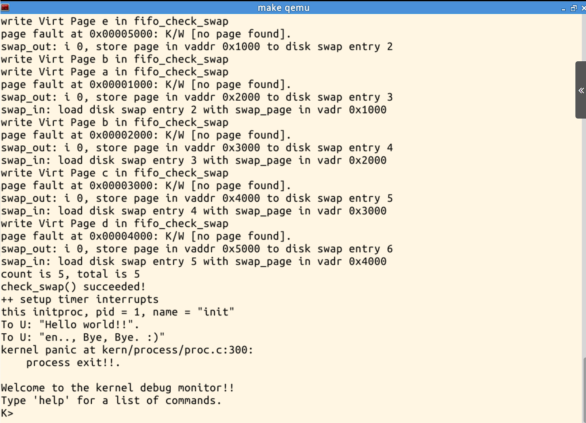

# Lab4 Report
TCB数据结构
```c
struct proc_struct {
    enum proc_state state; // Process state
    int pid; // Process ID
    int runs; // the running times of Proces
    uintptr_t kstack; // Process kernel stack
    volatile bool need_resched; // need to be rescheduled to release CPU?
    struct proc_struct *parent; // the parent process
    struct mm_struct *mm; // Process's memory management field
    struct context context; // Switch here to run process
    struct trapframe *tf; // Trap frame for current interrupt
    uintptr_t cr3; // the base addr of Page Directroy Table(PDT)
    uint32_t flags; // Process flag
    char name[PROC_NAME_LEN + 1]; // Process name
    list_entry_t list_link; // Process link list
    list_entry_t hash_link; // Process hash list
}
```
| 字段名       | 含义                                                         |
| ------------ | ------------------------------------------------------------ |
| `state`      | 进程所处状态|
| `pid`        | 进程ID|
| `kstack`     | 进程内核栈地址|
| `parent`     | 父进程 |
| `mm`         | 内存管理的信息，包括内存映射列表、页表指针等|
| `context`    | 进程的上下文，用于进程切换|
| `tf`         | 中断帧的指针，记录了进程在被中断前的状态|
| `cr3`        |cr3 保存页表的物理地址，但是当为内核线程时，内核线程没有用户空间，cr3 等于boot_cr3，boot_cr3指向了uCore启动时建立好的内核虚拟空间的页目录表首地址。|

## 练习1 
**分配并初始化一个进程控制块**
alloc_proc函数（位于kern/process/proc.c中）负责分配并返回一个新的struct proc_struct结构，用于存储新建立的内核线程的管理信息。ucore需要对这个结构进行最基本的初始化，你需要完成这个初始化过程。
```c
static struct proc_struct *
alloc_proc(void) {
      struct proc_struct *proc = kmalloc(sizeof(struct  
                                         proc_struct));
      if (proc != NULL) {
          proc->state = PROC_UNINIT; //进程为未初始化状态，枚举类型在.c中定义
          proc->pid = -1;            //进程PID为-1，即未分配有效pid
          proc->runs = 0;            //运行次数0
          proc->kstack = 0;          //内核栈地址，未分配
          proc->need_resched = 0;    //不需要调度
          proc->parent = NULL;       //父进程为空
          proc->mm = NULL;           //虚拟内存为空
          memset(&(proc->context), 0, sizeof(struct 
                 context));          //初始化上下文，分配空间
          proc->tf = NULL;           //中断帧指针为空，还没有分配
          proc->cr3 = boot_cr3;      //页目录为内核页目录表的地址
          proc->flags = 0;           //标志位为0
          memset(proc->name, 0, PROC_NAME_LEN);//进程名为0
    }
    return proc;
}
```


## 练习2 
**为新创建的内核线程分配资源**
创建一个内核线程需要分配和设置好很多资源。kernel_thread函数通过调用do_fork函数完成具体内核线程的创建工作。do_kernel函数会调用alloc_proc函数来分配并初始化一个进程控制块，但alloc_proc只是找到了一小块内存用以记录进程的必要信息，并没有实际分配这些资源。ucore一般通过do_fork实际创建新的内核线程。do_fork的作用是，创建当前内核线程的一个副本，它们的执行上下文、代码、数据都一样，但是存储位置不同。在这个过程中，需要给新内核线程分配资源，并且复制原进程的状态。你需要完成在kern/process/proc.c中的do_fork函数中的处理过程。它的大致执行步骤包括：

+ 调用alloc_proc，首先获得一块用户信息块。（即调用练习1写的函数）
+ 为进程分配一个内核栈。 即kstack
+ 复制原进程的内存管理信息到新进程（但内核线程不必做此事）
+ 复制原进程上下文到新进程
+ 将新进程添加到进程列表
+ 唤醒新进程
+ 返回新进程号

用到的函数和变量
| 步骤 | 描述 |
| --- | --- |
| `alloc_proc` | 创建一个 `proc_struct` 并初始化字段|
| `setup_kstack` | 为子进程分配内核栈（大小为 `KSTACKPAGE`） |
| `copy_mm` | 根据 `clone_flags` 复制或共享父进程的内存管理结构，如果 `clone_flags & CLONE_VM`，则“共享”；否则“复制” |
| `copy_thread` | 设置进程的陷入帧（`tf`）和上下文 |
| `hash_proc` | 将 `proc_struct` 插入哈希表和进程列表 |
| `get_pid` | 为进程分配一个唯一的进程 ID |
| `wakeup_proc` | 将新的子进程设置为可运行状态 |
| **变量** | **描述** |
| `proc_list` | 进程集合的列表 |
| `nr_process` | 进程集合中的进程数量 |


|步骤	|描述|
|-|---------------|
|1	|调用 alloc_proc 分配一个 proc_struct|
|2|	调用 setup_kstack 为子进程分配内核栈|
|3|	根据 clone_flag 调用 copy_mm 来复制或共享内存管理结构|
|4|	调用 copy_thread 设置 tf 和进程上下文|
|5|	将 proc_struct 插入哈希表和进程列表|
|6|	调用 wakeup_proc 使新的子进程变为可运行状态|
|7|	使用子进程的进程 ID 设置返回值|

```c
int do_fork(uint32_t clone_flags, uintptr_t stack, struct trapframe *tf) {
    int ret = -E_NO_FREE_PROC;
    struct proc_struct *proc;
    if (nr_process >= MAX_PROCESS) {
        goto fork_out;
    }
    ret = -E_NO_MEM;
    proc=alloc_proc();
    if(!proc)goto bad_fork_cleanup_proc;//分配PCB失败
    else
    {
        if(setup_kstack(proc)!=0)goto bad_fork_cleanup_kstack;//分配内核栈失败
        copy_mm(clone_flags,proc);//根据clone_flags设置mm
        copy_thread(proc,stack,tf);//设置trapframe和context
        proc->pid=get_pid();//分配pid
        hash_proc(proc);//加入hash_list
        list_add(&proc_list, &(proc->list_link));//加入proc_list
        nr_process++;//总进程数加1
        wakeup_proc(proc); // 唤醒当前进程
        ret=proc->pid;//返回进程号
    }
fork_out:
    return ret;

bad_fork_cleanup_kstack:
    put_kstack(proc);
bad_fork_cleanup_proc:
    kfree(proc);
    goto fork_out;
}
```

## 练习3
**阅读代码，理解 proc_run 函数和它调用的函数如何完成进程切换的。**
```c
void proc_run(struct proc_struct *proc) {
    if (proc != current) {
        bool intr_flag;
        struct proc_struct *prev = current, *next = proc;
        local_intr_save(intr_flag);
        {
            current = proc;
            load_esp0(next->kstack + KSTACKSIZE);
            lcr3(next->cr3);
            switch_to(&(prev->context), &(next->context));
        }
        local_intr_restore(intr_flag);
    }
}
```
**理解：**
准备知识：参数struct proc_struct *proc为要调度运行的进程PCB,current为全局变量，保存着当前运行的进程PCB
1. 首先通过判断proc != current来保证当前运行的和要运行的不是一个进程
2. intr_flag，用于屏蔽中断
3. struct proc_struct *prev = current, *next = proc;将prev指向目前运行的进程，next指向要调度的进程，方便后续进行切换
4. local_intr_save(intr_flag);关中断，避免中断干扰
5.  进行切换，过程如下：
    current = proc;将current指向要调度运行的进程
    load_esp0(next->kstack + KSTACKSIZE);加载待调度进程的内核栈基地址
    lcr3(next->cr3);更换页表
    switch_to(&(prev->context), &(next->context));上下文切换
6.  local_intr_restore(intr_flag);关中断
## 结果
