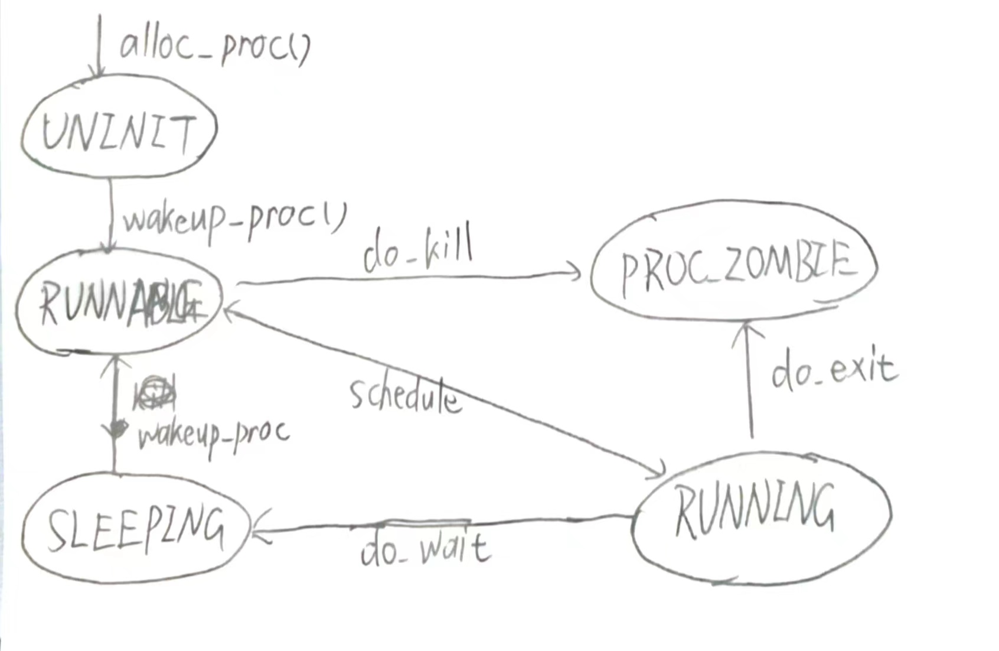
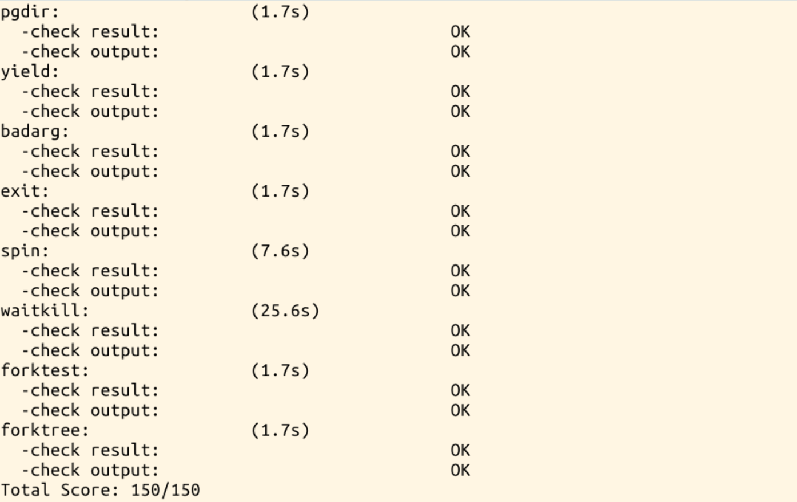

# Lab5 Report

***
## 练习1

`do_execv`函数调用`load_icode`（位于kern/process/proc.c中）来加载并解析一个处于内存中的ELF执行文件格式的应用程序，建立相应的用户内存空间来放置应用程序的代码段、数据段等，且要设置好`proc_struct`结构中的成员变量`trapframe`中的内容，确保在执行此进程后，能够从应用程序设定的起始执行地址开始执行。需设置正确的`trapframe`内容。

实验所需填充的代码段主要作用为：
重新设置进程的中断帧，使得在执行中断返回指令`iret`后，能够让CPU转到用户态特权级，并回到用户态内存空间，使用用户态的代码段、数据段和堆栈，且能够跳转到用户进程的第一条指令执行，并确保在用户态能够响应中断。
具体代码如下：

```c
static int load_icode(unsigned char *binary, size_t size) {
    ...
    tf->tf_cs = USER_CS;//将tf_cs设置为用户态
    tf->tf_ds = tf->tf_es = tf->tf_ss = USER_DS;//tf_ds=tf_es=tf_ss设置为用户态
    tf->tf_esp = USTACKTOP;//将esp设置为用户栈的栈顶。
    tf->tf_eip = elf->e_entry;//eip指向程序的入口，即elf中的e_entry
    tf->tf_eflags = FL_IF;//允许中断产生
    ret = 0;
    ...
}
```

***
## 练习2

创建子进程的函数`do_fork`在执行中将拷贝当前进程（即父进程）的用户内存地址空间中的合法内容到新进程中（子进程），完成内存资源的复制。具体是通过`copy_range`函数（位于kern/mm/pmm.c中）实现的，请补充`copy_range`的实现，确保能够正确执行。

我们的代码只需实现将父进程的内存直接复制给子进程（调用一个memcpy即可）。

```c
int copy_range(pde_t *to, pde_t *from, uintptr_t start, uintptr_t end, bool share) {
	...
        uintptr_t kva_src = page2kva(page);
        uintptr_t kva_dst = page2kva(npage);
        memcpy(kva_dst, kva_src, PGSIZE);
        ret=page_insert(to, npage, start, perm);
        assert(ret == 0);
	...
}
```
使用到的函数：
`page2kva(struct Page *page)`：返回kernel vritual addr

***
## 练习3

阅读分析源代码，理解进程执行 fork/exec/wait/exit 的实现(kern/process/proc.c)，以及系统调用的实现。

### `fork`（实际上的函数为`do_fork`）

- 分配并初始化进程控制块`alloc_proc`;
- 分配并初始化内核栈`setup_stack`;
- 根据`clone_flag`标志复制或共享进程内存管理结构`copy_mm`;
- 设置进程在内核正常运行和调度所需的中断帧tf和上下文`copy_thread`;
- 调用`get_pid()`为进程分配一个PID;
- 把设置好的进程控制块加入`hash_list`和`proc_list`两个全局进程链表中;
- 返回进程的PID。

核心代码如下：
```c
    if ((proc = alloc_proc()) == NULL)
        goto fork_out;
    proc->parent = current;
    if ((ret = setup_kstack(proc)) != 0)
        goto fork_out;
    if ((ret = copy_mm(clone_flags, proc)) != 0)
        goto fork_out;
    copy_thread(proc, stack, tf);
    ret = proc->pid = get_pid();
    hash_proc(proc);//建立哈希映射
    set_links(proc);//设置进程链接
    wakeup_proc(proc);//唤醒新进程
```

### `exec`（实际上的函数为`do_execve`）

- 检查进程名称的地址和长度是否合法，如果合法，将名称暂时保存在函数栈中;
- 如果mm不为NULL：
    - 设置页表为内核空间页表;
    - 判断mm的引用计数减1后是否为0，如果为0，则表明没有进程再需要此进程所占用的内存空间，根据mm中的记录，释放进程所占用户空间内存和进程页表本身所占空间。
    - 最后把当前进程的mm内存管理指针为空。
- 将代码加载进内存`load_icode`;
- 设置进程名称`set_proc_name`。

代码如下：
```c
int
do_execve(const char *name, size_t len, unsigned char *binary, size_t size) {
    struct mm_struct *mm = current->mm;
    if (!user_mem_check(mm, (uintptr_t)name, len, 0)) {
        return -E_INVAL;
    }
    if (len > PROC_NAME_LEN) {
        len = PROC_NAME_LEN;
    }

    char local_name[PROC_NAME_LEN + 1];
    memset(local_name, 0, sizeof(local_name));
    memcpy(local_name, name, len);

    if (mm != NULL) {
        lcr3(boot_cr3);
        if (mm_count_dec(mm) == 0) {
            exit_mmap(mm);
            put_pgdir(mm);
            mm_destroy(mm);
        }
        current->mm = NULL;
    }
    int ret;
    if ((ret = load_icode(binary, size)) != 0) {
        goto execve_exit;
    }
    set_proc_name(current, local_name);
    return 0;

execve_exit:
    do_exit(ret);
    panic("already exit: %e.\n", ret);
}
```

### `wait`（实际上的函数为`do_wait`）

- 如果`PID!=0`，找到进程ID==PID的子进程；否则找任意一个处于退出状态的子进程。
- 根据PID找到需要等待的子进程PCB：
    - 如果没有需要等待的子进程，那么返回`E_BAD_PROC`;
    - 如果此子进程的执行状态不为`PROC_ZOMBIE`，表明此子进程还没有退出，则当前进程设置执行状态为`PROC_SLEEPING`（睡眠），睡眠原因为`WT_CHILD`(即等待子进程退出)，调用`schedule()`函数选择新的进程执行，自己睡眠等待;
    - 如果此子进程的执行状态为`PROC_ZOMBIE`，表明此子进程处于退出状态，需要当前进程(即子进程的父进程)完成对子进程的最终回收工作，即首先把子进程控制块从两个进程队列中删除，并释放子进程的内核堆栈和进程控制块。

代码如下：
```c
    haskid = 0;
    if (pid != 0) {
        proc = find_proc(pid);
        if (proc != NULL && proc->parent == current) {
            haskid = 1;
            if (proc->state == PROC_ZOMBIE) {
                goto found;
            }
        }
    }
    else {
        proc = current->cptr;
        for (; proc != NULL; proc = proc->optr) {
            haskid = 1;
            if (proc->state == PROC_ZOMBIE) {
                goto found;
            }
        }
    }
    if (haskid) {
        current->state = PROC_SLEEPING;
        current->wait_state = WT_CHILD;
        schedule();
        if (current->flags & PF_EXITING) {
            do_exit(-E_KILLED);
        }
        goto repeat;
    }
    return -E_BAD_PROC;
found:
    if (proc == idleproc || proc == initproc) {
        panic("wait idleproc or initproc.\n");
    }
    if (code_store != NULL) {
        *code_store = proc->exit_code;
    }
    local_intr_save(intr_flag);
    {
        unhash_proc(proc);
        remove_links(proc);
    }
    local_intr_restore(intr_flag);
    put_kstack(proc);
    kfree(proc);
    return 0;
```

### `exit`（实际上的函数为`do_exit`）

- 释放进程的虚拟内存空间；
- 设置当期进程状态为`PROC_ZOMBIE`,设置当前进程的退出码为`error_code`;
- 如果父进程等待当前进程，即父进程的`wait_state`被置为`WT_CHILD`，则此时就可以唤醒父进程;
- 将当前进程的所有子进程变为`init`的子进程，如果某个子进程的执行状态是`PROC_ZOMBIE`,则需要唤醒`init`来完成对此子进程的最后回收工作;
- 主动调用调度函数`schedule()`进行调度。

代码如下：
```c
int
do_exit(int error_code) {
    if (current == idleproc) {
        panic("idleproc exit.\n");
    }
    if (current == initproc) {
        panic("initproc exit.\n");
    }
    
    struct mm_struct *mm = current->mm;
    if (mm != NULL) {
        lcr3(boot_cr3);
        if (mm_count_dec(mm) == 0) {
            exit_mmap(mm);
            put_pgdir(mm);
            mm_destroy(mm);
        }
        current->mm = NULL;
    }
    current->state = PROC_ZOMBIE;
    current->exit_code = error_code;
    
    bool intr_flag;
    struct proc_struct *proc;
    local_intr_save(intr_flag);
    {
        proc = current->parent;
        if (proc->wait_state == WT_CHILD) {
            wakeup_proc(proc);
        }
        while (current->cptr != NULL) {
            proc = current->cptr;
            current->cptr = proc->optr;
    
            proc->yptr = NULL;
            if ((proc->optr = initproc->cptr) != NULL) {
                initproc->cptr->yptr = proc;
            }
            proc->parent = initproc;
            initproc->cptr = proc;
            if (proc->state == PROC_ZOMBIE) {
                if (initproc->wait_state == WT_CHILD) {
                    wakeup_proc(initproc);
                }
            }
        }
    }
    local_intr_restore(intr_flag);
    
    schedule();
    panic("do_exit will not return!! %d.\n", current->pid);
}
```
### 系统调用

应用程序指令需要将需要使用的系统调用编号放入EAX寄存器，系统调用最多支持5个参数，分别放在EDX、ECX、EBX、EDI、ESI这5个寄存器中，然后使用`INT 0x80`指令进入内核态;
操作系统内核根据中断号`0x80`得知是系统调用时，根据系统调用号和参数执行相应的操作。 

### 请给出ucore中一个用户态进程的执行状态生命周期图（包执行状态，执行状态之间的变换关系，以及产生变换的事件或函数调用）



执行：make grade。如果所显示的应用程序检测都输出ok，则基本正确
