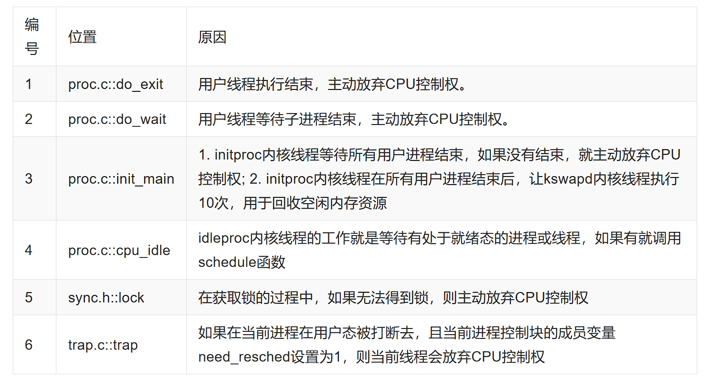

# Lab6 Report

## 练习1 
**使用 Round Robin 调度算法（不需要编码）**
对原来代码所进行的一些修改如下：
1. proc_struct
```c
struct proc_struct {                        //进程控制块
    enum proc_state state;                  //进程状态
    int pid;                                //进程ID
    int runs;                               //运行时间
    uintptr_t kstack;                       //内核栈位置
    volatile bool need_resched;             //是否需要调度，只对当前进程有效
    struct proc_struct *parent;             //父进程
    struct mm_struct *mm;                   //进程的虚拟内存
    struct context context;                 //进程上下文
    struct trapframe *tf;                   //当前中断帧的指针
    uintptr_t cr3;                          //当前页表地址
    uint32_t flags;                         //进程
    char name[PROC_NAME_LEN + 1];           //进程名字
    list_entry_t list_link;                 //进程链表       
    list_entry_t hash_link;                 //进程哈希表
    int exit_code;                          //退出码(发送到父进程)
    uint32_t wait_state;                    //等待状态
    struct proc_struct *cptr, *yptr, *optr; //进程间的一些关系
    struct run_queue *rq;                   //运行队列中包含进程
    list_entry_t run_link;                  //该进程的调度链表结构，该结构内部的连接组成了 运行队列 列表
    int time_slice;                         //该进程剩余的时间片，只对当前进程有效
    skew_heap_entry_t lab6_run_pool;        //该进程在优先队列中的节点，仅在 LAB6 使用
    uint32_t lab6_stride;                   //该进程的调度步进值，仅在 LAB6 使用
    uint32_t lab6_priority;                 //该进程的调度优先级，仅在 LAB6 使用
};
```
其中实验一重点关注rq、time_slice。rq为当前进程的队列指针，time_slice为进程剩余的时间片

2. alloc_proc函数
对proc_struct进行了修改，初始化函数也要进行相应的修改
实验1用到的有：
```c
proc->rq = NULL;
proc->time_slice = 0;
proc->run_link.prev = proc->run_link.next = NULL;
 ```

3. trap_dispatch
该函数是中断类型判断的函数，我们修改里面判断为时钟中断的部分，每当一个时钟中断来临，将当前进程的time_slice减1，方便后续的调度。
```c
 case IRQ_OFFSET + IRQ_TIMER:
    #if 0
    #endif
        ticks ++;
        sched_class_proc_tick(current);
        break;
```
就是增加sched_class_proc_tick(current);该函数会在后面部分介绍

**RR调度算法介绍**
框架：
```c
struct sched_class {
    // the name of sched_class
    const char *name;
    // Init the run queue
    void (*init)(struct run_queue *rq);
    // put the proc into runqueue, and this function must be called with rq_lock
    void (*enqueue)(struct run_queue *rq, struct proc_struct *proc);
    // get the proc out runqueue, and this function must be called with rq_lock
    void (*dequeue)(struct run_queue *rq, struct proc_struct *proc);
    // choose the next runnable task
    struct proc_struct *(*pick_next)(struct run_queue *rq);
    // dealer of the time-tick
    void (*proc_tick)(struct run_queue *rq, struct proc_struct *proc);
};
```
实现了接口的统一，接下来具体介绍RR中各函数的作用和实现。
1. RR_init
```c
static void RR_init(struct run_queue *rq) {
    list_init(&(rq->run_list));
    rq->proc_num = 0;
}
```
用于初始化调度队列
2. 
```c
static void RR_enqueue(struct run_queue *rq, struct proc_struct *proc) {
    assert(list_empty(&(proc->run_link)));
    list_add_before(&(rq->run_list), &(proc->run_link));
    if (proc->time_slice == 0 || proc->time_slice > rq->max_time_slice) {
        proc->time_slice = rq->max_time_slice;
    }
    proc->rq = rq;
    rq->proc_num ++;
}
```
用于将进程入调度队列，将其加入rq（设置rq并将proc->run_link加入链表中），时间片设成max_time_slice，设置PCB的rq，rq中进程数加1
3. RR_dequeue
```c
static void RR_dequeue(struct run_queue *rq, struct proc_struct *proc) {
    assert(!list_empty(&(proc->run_link)) && proc->rq == rq);
    list_del_init(&(proc->run_link));
    rq->proc_num --;
}
```
进程出队列，与入队列操作相反,即将其从队列中删除，rq可以不管，当其加入队列时（可以是其他的，会自己设置）

4. RR_pick_next
```c
static struct proc_struct *RR_pick_next(struct run_queue *rq) {
    list_entry_t *le = list_next(&(rq->run_list));
    if (le != &(rq->run_list)) {
        return le2proc(le, run_link);
    }
    return NULL;
}
```
选择队列中的一个进程，通过rq中的run_list头节点来获取一个进程，通过le2proc将list_entry_t转为对应的PCB，即对应的进程

5. RR_proc_tick
```c
static void RR_proc_tick(struct run_queue *rq, struct proc_struct *proc) {
    if (proc->time_slice > 0) {
        proc->time_slice --;
    }
    if (proc->time_slice == 0) {
        proc->need_resched = 1;
    }
}
```
处理时间，时间到时将need_resche，使得后续CPU能进行调度。
**代码中调度器的选择设置**
在对应的调度器的.h文件中,定义了一个全局变量default_sched_class，将其函数指针指向上述所写的函数
```c
struct sched_class default_sched_class = {
    .name = "RR_scheduler",
    .init = RR_init,
    .enqueue = RR_enqueue,
    .dequeue = RR_dequeue,
    .pick_next = RR_pick_next,
    .proc_tick = RR_proc_tick,
};
```
然后再写相应的内联函数
```c
sched_class_enqueue(struct proc_struct *proc) {
    if (proc != idleproc) {
        sched_class->enqueue(rq, proc);
    }
}

static inline void
sched_class_dequeue(struct proc_struct *proc) {
    sched_class->dequeue(rq, proc);
}

static inline struct proc_struct *
sched_class_pick_next(void) {
    return sched_class->pick_next(rq);
}

static void
sched_class_proc_tick(struct proc_struct *proc) {
    if (proc != idleproc) {
        sched_class->proc_tick(rq, proc);
    }
    else {
        proc->need_resched = 1;
    }
}

static struct run_queue __rq;

void
sched_init(void) {
    list_init(&timer_list);

    sched_class = &default_sched_class;

    rq = &__rq;
    rq->max_time_slice = MAX_TIME_SLICE;
    sched_class->init(rq);

    cprintf("sched class: %s\n", sched_class->name);
}
```
进一步封装，实际调度器使用的就是上述函数，上述函数调用的是sched_class中的函数
```c
void sched_init(void) {
    list_init(&timer_list);

    sched_class = &default_sched_class;

    rq = &__rq;
    rq->max_time_slice = MAX_TIME_SLICE;
    sched_class->init(rq);

    cprintf("sched class: %s\n", sched_class->name);
}
```
初始化中sched_class = &default_sched_class;将其指向了选择的调度器，至此选择完成。后续实验二将头文件应用更改即可，或者将struct sched_class default_sched_class名字修改，使得使用新实现的调度算法。

**RR调度过程**
```c
void schedule(void) {
    bool intr_flag;
    struct proc_struct *next;
    local_intr_save(intr_flag);
    {
        current->need_resched = 0;
        if (current->state == PROC_RUNNABLE) {
            sched_class_enqueue(current);
        }
        if ((next = sched_class_pick_next()) != NULL) {
            sched_class_dequeue(next);
        }
        if (next == NULL) {
            next = idleproc;
        }
        next->runs ++;
        if (next != current) {
            proc_run(next);
        }
    }
    local_intr_restore(intr_flag);
}
```
上述调度函数较为简单不再说明，重点关注什么时候会调用*schedule*

其中主要关注1与6，代表进程执行的两种情况
1. 时间片没用完，进程结束
结束调用do_exit
```c
int do_exit(int error_code) {
    if (current == idleproc) {
        panic("idleproc exit.\n");
    }
    if (current == initproc) {
        panic("initproc exit.\n");
    }
    
    struct mm_struct *mm = current->mm;
    if (mm != NULL) {
        lcr3(boot_cr3);
        if (mm_count_dec(mm) == 0) {
            exit_mmap(mm);
            put_pgdir(mm);
            mm_destroy(mm);
        }
        current->mm = NULL;
    }
    current->state = PROC_ZOMBIE;
    current->exit_code = error_code;
    
    bool intr_flag;
    struct proc_struct *proc;
    local_intr_save(intr_flag);
    {
        proc = current->parent;
        if (proc->wait_state == WT_CHILD) {
            wakeup_proc(proc);
        }
        while (current->cptr != NULL) {
            proc = current->cptr;
            current->cptr = proc->optr;
    
            proc->yptr = NULL;
            if ((proc->optr = initproc->cptr) != NULL) {
                initproc->cptr->yptr = proc;
            }
            proc->parent = initproc;
            initproc->cptr = proc;
            if (proc->state == PROC_ZOMBIE) {
                if (initproc->wait_state == WT_CHILD) {
                    wakeup_proc(initproc);
                }
            }
        }
    }
    local_intr_restore(intr_flag);
    
    schedule();
    panic("do_exit will not return!! %d.\n", current->pid);
}
```
自己会主动调用schedule();进行调度
2. 时间片用完，进程还没结束
我们前面知道始终中断会自己调用sched_class_proc_tick(current);（具体实现在上面有讨论）
当时间用完，将need_resched置为一后，我们看trap的源码
```c
void trap(struct trapframe *tf) {
    // dispatch based on what type of trap occurred
    // used for previous projects
    if (current == NULL) {
        trap_dispatch(tf);
    }
    else {
        // keep a trapframe chain in stack
        struct trapframe *otf = current->tf;
        current->tf = tf;
    
        bool in_kernel = trap_in_kernel(tf);
    
        trap_dispatch(tf);
    
        current->tf = otf;
        if (!in_kernel) {
            if (current->flags & PF_EXITING) {
                do_exit(-E_KILLED);
            }
            if (current->need_resched) {
                schedule();
            }
        }
    }
}
```
先调用的trap_dispatch(tf);判断类型，在里面进行进程时间减少的操作。
```c
 if (current->need_resched) {
        schedule();
    }
```
当need_resched是1，主动使用schedule();进行调度。正好就是时间片用完进行调度。
***
## 练习2 
**实现 Stride Scheduling 调度算法（需要编码）**
该算法较为重要的两个变量：
- stride：步幅，表示该进程当前的调度权。每次需要调度时优先选择stride值最小的进程进行调度。每次调度后stride加上 pass。
- pass:表示每次前进的步数。该值仅与优先级相关。可以令 P.pass =BigStride /P.priority，因此pass与优先级成反比。为每个进程分配的时间将与其优先级成正比，因为pass越小通常被调度次数就会越多。

即每次选择stride的上处理机，同时将stride增加BigStride /P.priority作为新的stride。基于此我们的调度队列改成    skew_heap_entry_t lab6_run_pool; 用一个斜堆来方便的获取stride最小的进程。
为此我们要写一个比较大小的函数来实现按照stride比较。(ucore已经帮写好了)
```c
static int proc_stride_comp_f(void *a, void *b)
{
     struct proc_struct *p = le2proc(a, lab6_run_pool);
     struct proc_struct *q = le2proc(b, lab6_run_pool);
     int32_t c = p->lab6_stride - q->lab6_stride;
     if (c > 0) return 1;
     else if (c == 0) return 0;
     else return -1;
}
```
我们重写sched_class来实现这个调度过程，代码如下：
1. stride_init
```c
static void stride_init(struct run_queue *rq) {
     /* LAB6: YOUR CODE 
      * (1) init the ready process list: rq->run_list
      * (2) init the run pool: rq->lab6_run_pool
      * (3) set number of process: rq->proc_num to 0       
      */
    rq->lab6_run_pool = NULL;
    rq->proc_num = 0;
}
```
2. 
```c
static void stride_enqueue(struct run_queue *rq, struct proc_struct *proc) {
     /* LAB6: YOUR CODE 
      * (1) insert the proc into rq correctly
      * NOTICE: you can use skew_heap or list. Important functions
      *         skew_heap_insert: insert a entry into skew_heap
      *         list_add_before: insert  a entry into the last of list   
      * (2) recalculate proc->time_slice
      * (3) set proc->rq pointer to rq
      * (4) increase rq->proc_num
      */
    rq->lab6_run_pool = skew_heap_insert(rq->lab6_run_pool, &(proc->lab6_run_pool), proc_stride_comp_f);
    if (proc->time_slice == 0 || proc->time_slice > rq->max_time_slice)
        proc->time_slice = rq->max_time_slice;
    proc->rq = rq;
    rq->proc_num ++;
}
```
将该进程入调度队列，设置time_slice，设置rq以及将进程数加1。与RR类似，不同的就是入的队列不一样。
3. stride_dequeue
```c
static void stride_dequeue(struct run_queue *rq, struct proc_struct *proc) {
     /* LAB6: YOUR CODE 
      * (1) remove the proc from rq correctly
      * NOTICE: you can use skew_heap or list. Important functions
      *         skew_heap_remove: remove a entry from skew_heap
      *         list_del_init: remove a entry from the  list
      */
    rq->lab6_run_pool = skew_heap_remove(rq->lab6_run_pool, &(proc->lab6_run_pool), proc_stride_comp_f);
    rq->proc_num --;
}
```
4. stride_pick_next
```c
static struct proc_struct * stride_pick_next(struct run_queue *rq) {
     /* LAB6: YOUR CODE 
      * (1) get a  proc_struct pointer p  with the minimum value of stride
             (1.1) If using skew_heap, we can use le2proc get the p from rq->lab6_run_poll
             (1.2) If using list, we have to search list to find the p with minimum stride value
      * (2) update p;s stride value: p->lab6_stride
      * (3) return p
      */
    if (rq->lab6_run_pool == NULL)
        return NULL;
    skew_heap_entry_t *le = rq->lab6_run_pool;
    struct proc_struct * p = le2proc(le, lab6_run_pool);
    p->lab6_stride += BIG_STRIDE / p->lab6_priority;
    return p;
}
```
该斜堆的堆顶就是stride最小的进程，所以直接去堆顶即可。
5. stride_proc_tick
```c
static void stride_proc_tick(struct run_queue *rq, struct proc_struct *proc) {
     /* LAB6: YOUR CODE */
    if (proc->time_slice > 0) {
        proc->time_slice --;
    }
    if (proc->time_slice == 0) {
        proc->need_resched = 1;
    }
}
```
与RR一致
整体上与RR差别不大，主要是修改stride_pick_next取的进程，以及进队列和出队列一些值的修改，总体过程差别不大。
lab6_priority由函数lab6_set_priority设置,PCB初始化时设为1（alloc_proc中）。

