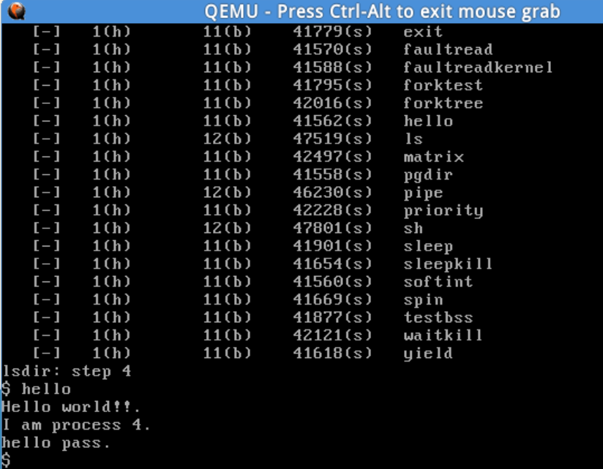

# Lab8 Report
## 练习1 
**完成读文件操作的实现（需要编码）**
首先了解打开文件的处理流程，然后参考本实验后续的文件读写操作的过程分析，编写在sfs_inode.c中sfs_io_nolock读文件中数据的实现代码。
**文件系统架构**

我们来讨论一下ucore中VFS是怎么向上提供统一的接口的：
我们看上图的函数调用链，从VFS的vop_write跳到sfs_write这个确定的文件系统的函数，我们查看一下内部的实现
可以在VFS文件夹下的inode.h中找到
```c
#define vop_open(node, open_flags)                                  (__vop_op(node, open)(node, open_flags))
#define vop_close(node)                                             (__vop_op(node, close)(node))
#define vop_read(node, iob)                                         (__vop_op(node, read)(node, iob))
#define vop_write(node, iob)                                        (__vop_op(node, write)(node, iob))
#define vop_fstat(node, stat)                                       (__vop_op(node, fstat)(node, stat))
#define vop_fsync(node)                                             (__vop_op(node, fsync)(node))
#define vop_namefile(node, iob)                                     (__vop_op(node, namefile)(node, iob))
#define vop_getdirentry(node, iob)                                  (__vop_op(node, getdirentry)(node, iob))
#define vop_reclaim(node)                                           (__vop_op(node, reclaim)(node))
#define vop_ioctl(node, op, data)                                   (__vop_op(node, ioctl)(node, op, data))
#define vop_gettype(node, type_store)                               (__vop_op(node, gettype)(node, type_store))
#define vop_tryseek(node, pos)                                      (__vop_op(node, tryseek)(node, pos))
#define vop_truncate(node, len)                                     (__vop_op(node, truncate)(node, len))
#define vop_create(node, name, excl, node_store)                    (__vop_op(node, create)(node, name, excl, node_store))
#define vop_lookup(node, path, node_store)                          (__vop_op(node, lookup)(node, path, node_store))
```
其中__vop_op(node, open)为
```c
#define __vop_op(node, sym)                                                                         \
    ({                                                                                              \
        struct inode *__node = (node);                                                              \
        assert(__node != NULL && __node->in_ops != NULL && __node->in_ops->vop_##sym != NULL);      \
        inode_check(__node, #sym);                                                                  \
        __node->in_ops->vop_##sym;                                                                  \
     })
```
所以就是调用了 __node->in_ops->vop_##sym;write的例子就是 ___node->in_ops->vop_write__
inode数据结构如下：
```c
struct inode {
    union {
        struct device __device_info;
        struct sfs_inode __sfs_inode_info;
    } in_info;
    enum {
        inode_type_device_info = 0x1234,
        inode_type_sfs_inode_info,
    } in_type;
    int ref_count;
    int open_count;
    struct fs *in_fs;
    const struct inode_ops *in_ops;
};
```
in_ops就是对应的文件系统的操作函数，格式如下：
```c
struct inode_ops {
    unsigned long vop_magic;
    int (*vop_open)(struct inode *node, uint32_t open_flags);
    int (*vop_close)(struct inode *node);
    int (*vop_read)(struct inode *node, struct iobuf *iob);
    int (*vop_write)(struct inode *node, struct iobuf *iob);
    int (*vop_fstat)(struct inode *node, struct stat *stat);
    int (*vop_fsync)(struct inode *node);
    int (*vop_namefile)(struct inode *node, struct iobuf *iob);
    int (*vop_getdirentry)(struct inode *node, struct iobuf *iob);
    int (*vop_reclaim)(struct inode *node);
    int (*vop_gettype)(struct inode *node, uint32_t *type_store);
    int (*vop_tryseek)(struct inode *node, off_t pos);
    int (*vop_truncate)(struct inode *node, off_t len);
    int (*vop_create)(struct inode *node, const char *name, bool excl, struct inode **node_store);
    int (*vop_lookup)(struct inode *node, char *path, struct inode **node_store);
    int (*vop_ioctl)(struct inode *node, int op, void *data);
};
```
对于in_ops，在创建文件或者文件夹的时候已经设置好了，如下：
```c
static int sfs_create_inode(struct sfs_fs *sfs, struct sfs_disk_inode *din, uint32_t ino, struct inode **node_store) {
    struct inode *node;
    if ((node = alloc_inode(sfs_inode)) != NULL) {
        vop_init(node, sfs_get_ops(din->type), info2fs(sfs, sfs));
        struct sfs_inode *sin = vop_info(node, sfs_inode);
        sin->din = din, sin->ino = ino, sin->dirty = 0, sin->reclaim_count = 1;
        sem_init(&(sin->sem), 1);
        *node_store = node;
        return 0;
    }
    return -E_NO_MEM;
}
```
通过 vop_init(node, sfs_get_ops(din->type), info2fs(sfs, sfs));进行设置，vop_init如下：
```c
#define vop_init(node, ops, fs)                                     inode_init(node, ops, fs)
```
```c
void
inode_init(struct inode *node, const struct inode_ops *ops, struct fs *fs) {
    node->ref_count = 0;
    node->open_count = 0;
    node->in_ops = ops, node->in_fs = fs;
    vop_ref_inc(node);
}
```
而vop_init(node, sfs_get_ops(din->type), info2fs(sfs, sfs));通过sfs_get_ops(din->type)来传递，即
```c
static const struct inode_ops *sfs_get_ops(uint16_t type) {
    switch (type) {
    case SFS_TYPE_DIR:
        return &sfs_node_dirops;
    case SFS_TYPE_FILE:
        return &sfs_node_fileops;
    }
    panic("invalid file type %d.\n", type);
}
```
sfs_node_dirops与sfs_node_fileops是文件系统定义的全局变量
```c
// The sfs specific DIR operations correspond to the abstract operations on a inode.
static const struct inode_ops sfs_node_dirops = {
    .vop_magic                      = VOP_MAGIC,
    .vop_open                       = sfs_opendir,
    .vop_close                      = sfs_close,
    .vop_fstat                      = sfs_fstat,
    .vop_fsync                      = sfs_fsync,
    .vop_namefile                   = sfs_namefile,
    .vop_getdirentry                = sfs_getdirentry,
    .vop_reclaim                    = sfs_reclaim,
    .vop_gettype                    = sfs_gettype,
    .vop_lookup                     = sfs_lookup,
};
/// The sfs specific FILE operations correspond to the abstract operations on a inode.
static const struct inode_ops sfs_node_fileops = {
    .vop_magic                      = VOP_MAGIC,
    .vop_open                       = sfs_openfile,
    .vop_close                      = sfs_close,
    .vop_read                       = sfs_read,
    .vop_write                      = sfs_write,
    .vop_fstat                      = sfs_fstat,
    .vop_fsync                      = sfs_fsync,
    .vop_reclaim                    = sfs_reclaim,
    .vop_gettype                    = sfs_gettype,
    .vop_tryseek                    = sfs_tryseek,
    .vop_truncate                   = sfs_truncfile,
};
```
至此，新建的文件或者文件夹已经设置好对应的函数，VFS对上提供统一接口。根目录可能在挂载的时候已经设置好了，这里不做讨论。
我们再来讨论里面主要的数据结构（进程PCB中增加了一个成员变量struct files_struct *filesp;）：
1. files_struct
```c
struct files_struct {
    struct inode *pwd;      // inode of present working directory
    struct file *fd_array;  // opened files array
    int files_count;        // the number of opened files
    semaphore_t files_sem;  // lock protect sem
};
```
每个进程都有一个files_struct，存当前工作目录（方便查找文件，不用从根目录开始）、打开文件表fd_array、打开文件个数、一个信号量控制访问。
2. file
```c
struct file {
    enum {
        FD_NONE, FD_INIT, FD_OPENED, FD_CLOSED,
    } status;
    bool readable;
    bool writable;
    int fd;
    off_t pos;
    struct inode *node;
    int open_count;
};
```
打开文件表中的项，其中fd是在fd_array的下标，在第一次open的时候作为返回值返回，方便后续读写等。pos是地址偏移量，node存着索引节点，其中有文件的位置信息等。
3. inode
```c
struct inode {
    union {
        struct device __device_info;
        struct sfs_inode __sfs_inode_info;
    } in_info;
    enum {
        inode_type_device_info = 0x1234,
        inode_type_sfs_inode_info,
    } in_type;
    int ref_count;
    int open_count;
    struct fs *in_fs;
    const struct inode_ops *in_ops;
};
```
该inode中保存着底层不同文件系统的inode（如sfs_inode），抽象成一个统一结构。
练习1中我们要补充的函数就在SFS层，即一个确定的文件系统中。函数调用图中这部分缺少了一部分，**正确的过程**应该是：sfs_write->sfs_io->sfs_io_nolock->sfs_wbuf(读的话就是sfs_rbuf)
我们补充sfs_io_nolock，调用sfs_wbuf和sfs_rbuf完成读写。
我们补充主要就是处理三种情况：
1. 读第一块数据，且数据不在块的开头位置（即有偏移），即块中开头有部分数据不读
2. 读中间数据，读取整块
3. 读最后一块数据，考虑最后一块不占满额情况，即末尾有部分数据不读。
```c
  //LAB8:EXERCISE1 YOUR CODE HINT: call sfs_bmap_load_nolock, sfs_rbuf, sfs_rblock,etc. read different kind of blocks in file
	/*
	 * (1) If offset isn't aligned with the first block, Rd/Wr some content from offset to the end of the first block
	 *       NOTICE: useful function: sfs_bmap_load_nolock, sfs_buf_op
	 *               Rd/Wr size = (nblks != 0) ? (SFS_BLKSIZE - blkoff) : (endpos - offset)
	 * (2) Rd/Wr aligned blocks 
	 *       NOTICE: useful function: sfs_bmap_load_nolock, sfs_block_op
         * (3) If end position isn't aligned with the last block, Rd/Wr some content from begin to the (endpos % SFS_BLKSIZE) of the last block
	 *       NOTICE: useful function: sfs_bmap_load_nolock, sfs_buf_op	
	*/
```
代码如下：
```c
static int sfs_io_nolock(struct sfs_fs *sfs, struct sfs_inode *sin, void *buf, off_t offset, size_t *alenp, bool write) {
    struct sfs_disk_inode *din = sin->din;
    assert(din->type != SFS_TYPE_DIR);
    off_t endpos = offset + *alenp, blkoff;
    *alenp = 0;
	// calculate the Rd/Wr end position
    if (offset < 0 || offset >= SFS_MAX_FILE_SIZE || offset > endpos) {
        return -E_INVAL;
    }
    if (offset == endpos) {
        return 0;
    }
    if (endpos > SFS_MAX_FILE_SIZE) {
        endpos = SFS_MAX_FILE_SIZE;
    }
    if (!write) {
        if (offset >= din->size) {
            return 0;
        }
        if (endpos > din->size) {
            endpos = din->size;
        }
    }

    int (*sfs_buf_op)(struct sfs_fs *sfs, void *buf, size_t len, uint32_t blkno, off_t offset);
    int (*sfs_block_op)(struct sfs_fs *sfs, void *buf, uint32_t blkno, uint32_t nblks);
    if (write) {
        sfs_buf_op = sfs_wbuf, sfs_block_op = sfs_wblock;
    }
    else {
        sfs_buf_op = sfs_rbuf, sfs_block_op = sfs_rblock;
    }

    int ret = 0;
    size_t size, alen = 0;
    uint32_t ino;
    uint32_t blkno = offset / SFS_BLKSIZE;          // The NO. of Rd/Wr begin block
    uint32_t nblks = endpos / SFS_BLKSIZE - blkno;  // The size of Rd/Wr blocks
    if ((blkoff = offset % SFS_BLKSIZE) != 0) {                   	//读取第一部分
        size = (nblks != 0) ? (SFS_BLKSIZE - blkoff) : (endpos - offset);//计算第一个数据块的大小
    if ((ret = sfs_bmap_load_nolock(sfs, sin, blkno, &ino)) != 0) {  
    //查找内存文件索引对应的block的编号ino，即磁盘块号
            goto out;
        }
    
        if ((ret = sfs_buf_op(sfs, buf, size, ino, blkoff)) != 0) {   
            goto out;
        }//读写第一块中数据（可以不是一整块）
        alen += size;//修改实际读写数
        if (nblks == 0) {
            goto out;
        }
        buf += size, blkno ++, nblks --;
    }
    
    //读取中间部分的数据，每次读一块，直到将所有完整的块读完。不能直接用sfs_block_op读取nblks块，磁盘块号不一定连续，所以需要获取每一块的ino
    size = SFS_BLKSIZE;
    while (nblks != 0) {
        if ((ret = sfs_bmap_load_nolock(sfs, sin, blkno, &ino)) != 0) {
            goto out;
        }
        if ((ret = sfs_block_op(sfs, buf, ino, 1)) != 0) {
            goto out;
        }
        alen += size, buf += size, blkno ++, nblks --;
    }
    //读取第三部分的数据
    if ((size = endpos % SFS_BLKSIZE) != 0) {
        if ((ret = sfs_bmap_load_nolock(sfs, sin, blkno, &ino)) != 0) {
            goto out;
        }
        if ((ret = sfs_buf_op(sfs, buf, size, ino, 0)) != 0) {
            goto out;
        }
        alen += size;
    }
out:
    *alenp = alen;
    if (offset + alen > sin->din->size) {
        sin->din->size = offset + alen;
        sin->dirty = 1;
    }
    return ret;
}
```
**参数和函数说明**
1. sfs_io_nolock(struct sfs_fs *sfs, struct sfs_inode *sin, void *buf, off_t offset, size_t *alenp, bool write)

| 参数                   | 含义                                                         |
|------------------------|--------------------------------------------------------------|
| `struct sfs_fs *sfs`   | 文件系统结构体指针，表示要操作的文件所属的文件系统。             |
| `struct sfs_inode *sin` | 索引节点结构体指针，表示要读写的文件的索引节点,在sfs中定义，是inode的成员变量， sfs_inode还存着sfs_disk_inode，里面有物理位置的信息                |
| `void *buf`             | 缓冲区指针，用于存储读取或写入的数据。                           |
| `off_t offset`          | 偏移量，表示从文件的哪个位置开始读写。                           |
| `size_t *alenp`         | 数据长度指针，表示要读取或写入的数据长度，并返回实际读取或写入的数据长度。 |
| `bool write`            | 写入标志，表示是进行读取操作还是写入操作。如果为 `true`，表示进行写入操作；如果为 `false`，表示进行读取操作。 |

该函数实现从磁盘读写，实际调用sfs_bmap_load_nolock、sfs_wbuf、sfs_rbuf、sfs_wblock、sfs_rblock。
其中读写实际都用sfs_buf_op将sfs_wbuf、sfs_rbuf封装起来，sfs_block_op将sfs_wblock、sfs_rblock封装起来，下面只说明write的情况。
2. static int sfs_bmap_load_nolock(struct sfs_fs *sfs, struct sfs_inode *sin, uint32_t index, uint32_t *ino_store)
该函数用于获取该文件的index块磁盘的物理位置，存储在ino_store中（里面还调用了sfs_bmap_get_nolock，具体获取物理地址在里面实现，这里不详细说明）
| 参数 | 含义 |
| --- | --- |
| `sfs` | 指向 `struct sfs_fs` 类型的文件系统结构体指针，表示要操作的文件系统 |
| `sin` | 指向 `struct sfs_inode` 类型的索引节点结构体指针，表示要获取磁盘块号的索引节点 |
| `index` | `uint32_t` 类型的块索引，表示要获取的磁盘块的索引 |
| `ino_store` | 指向 `uint32_t` 类型的指针，用于存储加载的磁盘块号 |
3. int sfs_wbuf(struct sfs_fs *sfs, void *buf, size_t len, uint32_t blkno, off_t offset)
该函数将buf中len长度的内容写入磁盘块中，从块内offset位置开始。

| 参数 | 含义 |
| --- | --- |
| `sfs` | 指向 `struct sfs_fs` 类型的文件系统结构体指针，表示要操作的文件系统 |
| `buf` | 指向要写入的数据缓冲区的指针 |
| `len` | `size_t` 类型的参数，表示要写入的数据长度 |
| `blkno` | `uint32_t` 类型的参数，表示要写入的文件系统块号地址 |
| `offset` | `off_t` 类型的参数，表示在文件系统块中写入的偏移量 |
4. int sfs_wblock(struct sfs_fs *sfs, void *buf, uint32_t blkno, uint32_t nblks) 
将buf内容写入**连续**nblks个磁盘块中，起始块号为blkno（不是索引号），参数与上述类似不再赘述

**补充代码分析：**
1. 第一部分：
```c
    if ((blkoff = offset % SFS_BLKSIZE) != 0) {                   	//读取第一部分
        size = (nblks != 0) ? (SFS_BLKSIZE - blkoff) : (endpos - offset);//计算第一个数据块的大小
    if ((ret = sfs_bmap_load_nolock(sfs, sin, blkno, &ino)) != 0) {  
    //查找内存文件索引对应的block的编号ino，即磁盘块号
            goto out;
        }
    
        if ((ret = sfs_buf_op(sfs, buf, size, ino, blkoff)) != 0) {   
            goto out;
        }//读写第一块中数据（可以不是一整块）
        alen += size;//修改实际读写数
        if (nblks == 0) {
            goto out;
        }
        buf += size, blkno ++, nblks --;
    }
```
第一块数据可能不是从块头开始的，所以先用blkoff = (offset % SFS_BLKSIZE)获取块内偏移地址，同时用**size** = (nblks != 0) ? (SFS_BLKSIZE - blkoff) : (endpos - offset);求读写的长度。再用sfs_bmap_load_nolock(sfs, sin, blkno, &ino)将第blkno块的磁盘块号存到ino中，再调用sfs_buf_op（此时是写即sfs_wbuf）将buf中size的数据写到磁盘块中（从块内blkoff开始写）。最后结束修改buf位置，修改blkno索引号、nblks要读取的块数。
2. 第二部分：
```c
    //读取中间部分的数据，每次读一块，直到将所有完整的块读完。不能直接用sfs_block_op读取nblks块，磁盘块号不一定连续，所以需要获取每一块的ino
    size = SFS_BLKSIZE;
    while (nblks != 0) {
        if ((ret = sfs_bmap_load_nolock(sfs, sin, blkno, &ino)) != 0) {
            goto out;
        }
        if ((ret = sfs_block_op(sfs, buf, ino, 1)) != 0) {
            goto out;
        }
        alen += size, buf += size, blkno ++, nblks --;
    }
```
与第一部分类似，只是这都是读写整块数据，size固定为块大小，同时调用的函数改成sfs_block_op对整块操作即可。**注意的**是因为文件磁盘块不一定连续，所以不能直接一次读取完，每一块都要获取磁盘块号再读取。
3. 第三部分：
```c
    //读取第三部分的数据
    if ((size = endpos % SFS_BLKSIZE) != 0) {
        if ((ret = sfs_bmap_load_nolock(sfs, sin, blkno, &ino)) != 0) {
            goto out;
        }
        if ((ret = sfs_buf_op(sfs, buf, size, ino, 0)) != 0) {
            goto out;
        }
        alen += size;
    }
```
最后一块一定是从头开始的，只是结束位置不一定是块尾，我们用结束位置计算size = endpos % SFS_BLKSIZE即可，其它与第一部分一致(偏移量设为0)。

## 练习2
**完成基于文件系统的执行程序机制的实现**

改写proc.c中的load_icode函数和其他相关函数，实现基于文件系统的执行程序机制。

需要改动的函数有：

**`alloc_proc`函数**
只需要在进程结构的初始化语句中添加一项对files_struct指针的初始化即可：
```c
        proc->filesp = NULL;
```

**`do_fork`函数**
添加对PCB的`files_struct`结构也进行复制操作的代码：
```c
int do_fork(uint32_t clone_flags, uintptr_t stack, struct trapframe *tf) {
    int ret = -E_NO_FREE_PROC;
    struct proc_struct *proc;
    if (nr_process >= MAX_PROCESS) {
        goto fork_out;
    }
    ret = -E_NO_MEM;
    proc=alloc_proc();
    if(!proc)goto bad_fork_cleanup_proc;//分配PCB失败
    else
    {
        if(setup_kstack(proc)!=0)goto bad_fork_cleanup_kstack;//分配内核栈失败
        if ((ret = copy_files(clone_flags, proc)) != 0)goto bad_fork_cleanup_fs;//添加的语句，对file_struct结构进行复制操作
        copy_mm(clone_flags,proc);//根据clone_flags设置mm
        copy_thread(proc,stack,tf);//设置trapframe和context
        proc->pid=get_pid();//分配pid
        hash_proc(proc);//加入hash_list
        set_links(proc);//设置进程链接
        wakeup_proc(proc); // 唤醒当前进程
        ret=proc->pid;//返回进程号
    }
fork_out:
    return ret;

bad_fork_cleanup_fs:  //添加的语句
    put_files(proc);
bad_fork_cleanup_kstack:
    put_kstack(proc);
bad_fork_cleanup_proc:
    kfree(proc);
    goto fork_out;
}
```
使用到`copy_files`和`put_files`函数，用法和`copy_mm`类似，用于复制`files_struct`。

**`load_icode`函数(重点)**

在原本的`load_icode`函数中，ELF可执行文件直接从内存中读取。但在我们完善了文件系统后，需要使用`load_icode_read`函数来从文件系统中读取ELF header以及ELF各个段的数据。

原本的`load_icode`函数中也没有对执行的程序传入参数，因此在lab8中也需要补充。

观察`load_icode_read`函数：
```c
static int
load_icode_read(int fd, void *buf, size_t len, off_t offset) {
    int ret;
    if ((ret = sysfile_seek(fd, offset, LSEEK_SET)) != 0) {
        return ret;
    }
    if ((ret = sysfile_read(fd, buf, len)) != len) {
        return (ret < 0) ? ret : -1;
    }
    return 0;
}
```
显而易见，作用为从`fd`的`offset`读取长度为`len`的数据到`buf`中。

实现`load_icode`函数：
```c
// load_icode -  called by sys_exec-->do_execve
static int
load_icode(int fd, int argc, char **kargv) {

    if (current->mm != NULL) {
        panic("load_icode: current->mm must be empty.\n");
    }

    int ret = -E_NO_MEM;
    // 创建proc的内存管理结构，和lab8之前的一样，无需修改，直接复制过来即可
    struct mm_struct *mm;
    if ((mm = mm_create()) == NULL) {
        goto bad_mm;
    }
    if (setup_pgdir(mm) != 0) {
        goto bad_pgdir_cleanup_mm;
    }

    struct Page *page;
    // 这里要修改，要从文件中读取ELF header
    struct elfhdr __elf, *elf = &__elf;
    if ((ret = load_icode_read(fd, elf, sizeof(struct elfhdr), 0)) != 0) {
        goto bad_elf_cleanup_pgdir;
    }
    // 判断读取入的ELF header是否正确
    if (elf->e_magic != ELF_MAGIC) {
        ret = -E_INVAL_ELF;
        goto bad_elf_cleanup_pgdir;
    }

    struct proghdr __ph, *ph = &__ph;
    uint32_t vm_flags, perm, phnum;
    for (phnum = 0; phnum < elf->e_phnum; phnum ++) {
        // 从文件特定偏移处读取每个段的header（其中包括每个段的大小、偏移量等信息）
        off_t phoff = elf->e_phoff + sizeof(struct proghdr) * phnum;
        if ((ret = load_icode_read(fd, ph, sizeof(struct proghdr), phoff)) != 0) {
            goto bad_cleanup_mmap;
        }
        if (ph->p_type != ELF_PT_LOAD) {
            continue ;
        }
        if (ph->p_filesz > ph->p_memsz) {
            ret = -E_INVAL_ELF;
            goto bad_cleanup_mmap;
        }
        if (ph->p_filesz == 0) {
            continue ;
        }
        vm_flags = 0, perm = PTE_U;
        if (ph->p_flags & ELF_PF_X) vm_flags |= VM_EXEC;
        if (ph->p_flags & ELF_PF_W) vm_flags |= VM_WRITE;
        if (ph->p_flags & ELF_PF_R) vm_flags |= VM_READ;
        if (vm_flags & VM_WRITE) perm |= PTE_W;
        // 为当前段分配内存空间，和lab8之前的一样，无需修改，直接复制过来
        if ((ret = mm_map(mm, ph->p_va, ph->p_memsz, vm_flags, NULL)) != 0) {
            goto bad_cleanup_mmap;
        }
        off_t offset = ph->p_offset;// 该段在文件中的偏移量
        size_t off, size;
        uintptr_t start = ph->p_va, end, la = ROUNDDOWN(start, PGSIZE);

        ret = -E_NO_MEM;

        end = ph->p_va + ph->p_filesz;
        while (start < end) {
            // 设置该内存所对应的页表项，和lab8之前的一样，无需修改
            if ((page = pgdir_alloc_page(mm->pgdir, la, perm)) == NULL) {
                goto bad_cleanup_mmap;
            }
            off = start - la, size = PGSIZE - off, la += PGSIZE;
            if (end < la) {
                size -= la - end;
            }
            // 读取elf对应段内的数据并写入至该内存中，对应原本的 memcpy(page2kva(page) + off, from, size);
            if ((ret = load_icode_read(fd, page2kva(page) + off, size, offset)) != 0) {
                goto bad_cleanup_mmap;
            }
            start += size, offset += size;
        }
        end = ph->p_va + ph->p_memsz;
        // 对于段中当前页中剩余的空间（复制elf数据后剩下的空间），将其置为0
        if (start < la) {
            if (start == end) {
                continue ;
            }
            off = start + PGSIZE - la, size = PGSIZE - off;
            if (end < la) {
                size -= la - end;
            }
            memset(page2kva(page) + off, 0, size);
            start += size;
            assert((end < la && start == end) || (end >= la && start == la));
        }
        // 对于段中剩余页中的空间（复制elf数据后的多余页面），将其置为0
        while (start < end) {
            if ((page = pgdir_alloc_page(mm->pgdir, la, perm)) == NULL) {
                goto bad_cleanup_mmap;
            }
            off = start - la, size = PGSIZE - off, la += PGSIZE;
            if (end < la) {
                size -= la - end;
            }
            memset(page2kva(page) + off, 0, size);
            start += size;
        }
    }
    // 关闭读取
    sysfile_close(fd);

    // 设置栈内存，和之前一样
    vm_flags = VM_READ | VM_WRITE | VM_STACK;
    if ((ret = mm_map(mm, USTACKTOP - USTACKSIZE, USTACKSIZE, vm_flags, NULL)) != 0) {
        goto bad_cleanup_mmap;
    }
    uintptr_t esp = USTACKTOP;
    // 在用户进程的堆栈中设置参数
    char** buffer[EXEC_MAX_ARG_NUM]; //定义一个指针数组 buffer 用于保存参数的地址。
    //将每个参数拷贝到用户堆栈的页面中
    for (int i = 0; i < argc; i++) {
        struct Page *page = pgdir_alloc_page(mm->pgdir, USTACKTOP-(i+1)*PGSIZE , PTE_USER);//调用 pgdir_alloc_page 函数为每个参数分配一个页面
        assert(page != NULL);
        uintptr_t kva = page2kva(page);//通过 page2kva 函数获取页面的内核虚拟地址 kva
        memcpy(kva, kargv[i], EXEC_MAX_ARG_LEN + 1);//使用 memcpy 函数将参数从 kargv[i] 拷贝到该地址。
        esp -= PGSIZE;//每次拷贝后，减小 esp（栈指针）的值，使其指向下一个页面
        buffer[i] = esp;//将参数在用户堆栈中的地址保存到 buffer[i]
    }
    //除参数外还需给用户堆栈分配4个页（用户栈不仅用于存放参数，还要保留页面给局部变量、函数调用的返回地址、保存的寄存器值等）（和之前的代码相同）
    for (int i = argc; i < argc + 4; i++)
        assert(pgdir_alloc_page(mm->pgdir, USTACKTOP-(i+1)*PGSIZE , PTE_USER) != NULL);
    //将参数地址和参数个数设置到用户堆栈中
    esp -= sizeof(uintptr_t) * (argc + 1);//将esp减去存储argc个指针所需的空间。
    memcpy(esp, buffer, sizeof(uintptr_t) * argc);//将 buffer 中保存的参数地址拷贝到用户堆栈中
    esp -= sizeof(int);//将栈指针再减去一个 int 的大小
    *((int*) esp) = argc;//将 argc 的值存入该位置

   // setup current process's mm, cr3, reset pgidr (using lcr3 MARCO)
    mm_count_inc(mm);//增加引用计数
    current->mm = mm;//设置当前进程内存管理
    current->cr3 = PADDR(mm->pgdir);//设置页目录基址
    lcr3(PADDR(mm->pgdir));//加载页目录

    struct trapframe *tf = current->tf;
    memset(tf, 0, sizeof(struct trapframe));
    tf->tf_cs = USER_CS;
    tf->tf_ds = tf->tf_es = tf->tf_ss = USER_DS;
    tf->tf_esp = esp;
    tf->tf_eip = elf->e_entry;
    tf->tf_eflags = FL_IF;
    ret = 0;
out:
    return ret;
bad_cleanup_mmap:
    exit_mmap(mm);
bad_elf_cleanup_pgdir:
    put_pgdir(mm);
bad_pgdir_cleanup_mm:
    mm_destroy(mm);
bad_mm:
    goto out;
}
```

至此，实验二对源代码的修改完毕。

执行：make qemu。如果能看看到sh用户程序的执行界面，则基本成功了。如果在sh用户界面上可以执行”ls”,”hello”等其他放置在sfs文件系统中的其他执行程序，则可以认为本实验基本成功。

执行结果如下：

**本实验基本成功。**


