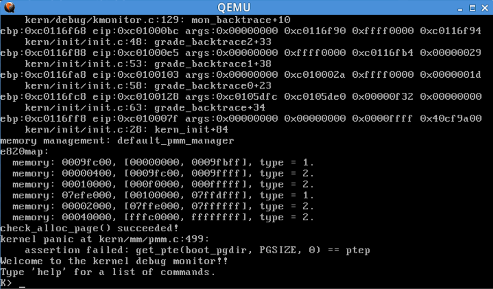
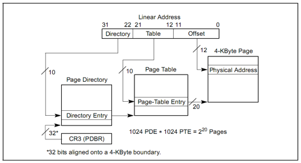
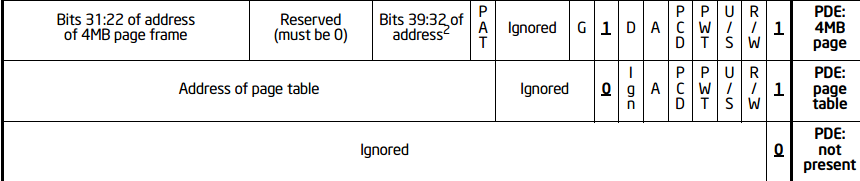
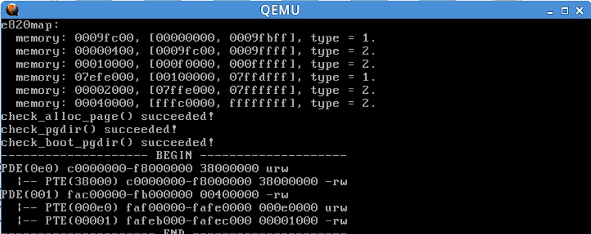
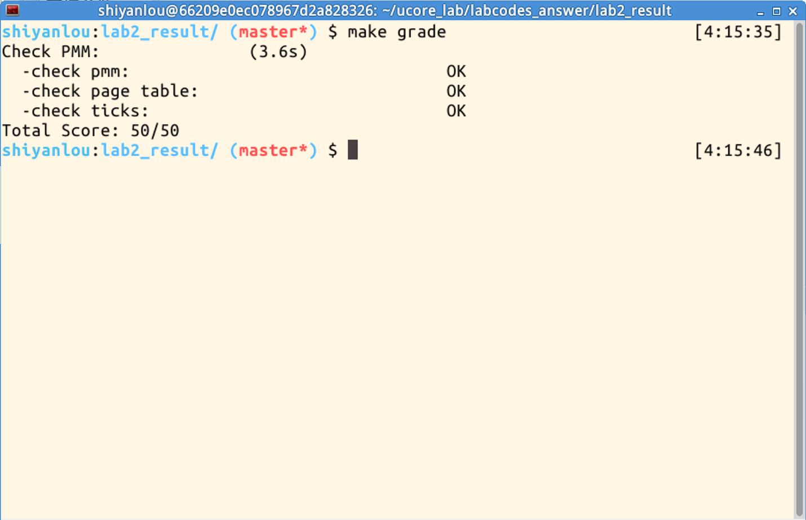

# Lab2 Report

***
## 练习1
实现 first-fit 连续物理内存分配算法
有两个较为重要的数据结构：
①
```c
struct Page {
    int ref;      
    uint32_t flags; 
    unsigned int property;
    list_entry_t page_link;
};
```

该结构体对应每一个物理页，其中ref为该页引用次数，flags用于记录是否为空闲页（1空闲0已分配）。
property与page_link均只有空闲块中的第一页会设置，为该空闲块中物理页的个数（property）和一个双向链表（指向前一个空闲块的首页与下一个空闲块的首页）（page_link）
②
```c
typedef struct {
            list_entry_t free_list;   
            unsigned int nr_free;   
} free_area_t;
```
链表指针指向空闲的块的首页，nr_free为空闲物理页总数量。
本试验中主要修改以下**四个函数**：
①该函数用于初始化free_area_t
```c
default_init(void) {
    list_init(&free_list);
    nr_free = 0;
}
```
list_init定义在lish.h文件中，用于链表初始化（前后指针指向自己）
nr_free=0将当前空闲物理页数置为0
②该函数用于初始化一段物理页为空闲块
```c
static void default_init_memmap(struct Page *base, size_t n) {
    assert(n > 0);//页数大于0
    struct Page *p = base;
    // 将这个空闲块的每个页面初始化
    for (; p != base + n; p ++) {
        // 每次循环首先检查p的PG_reserved位是否设置为1，表示空闲可分配
        assert(PageReserved(p));
        // 设置这一页的flag为0，表示这页空闲
        p->flags = 0;
        // 将这一页的ref设为0，即引用数置为0
        set_page_ref(p, 0);
        //判断是否是空闲块首页，修改property值
        if (p == base) {
            // 空闲块的第一页的连续空页值property设置为块中的总页数
            p->property = n;
            // 将空闲块的第一页的PG_property位设置为1，表示是起始页，可以被用作分配内存
            SetPageProperty(p);
        } else {
            p->property = 0;
        }
    }
    // 将首页加入free_list中
    list_add_before(&free_list, &(base->page_link));
    // 将空闲物理页的总数目加n
    nr_free += n;
}
```
③该函数用于分配物理空间
```c
static struct Page *default_alloc_pages(size_t n) {
    assert(n > 0);
    // 需要的页数大于目前总空闲物理页，直接返回，无法分配
    if (n > nr_free) {
        return NULL;
    }
    struct Page *page = NULL;
    // 指针le指向空闲链表头，因为链表的地址有序，直接从前往后找到第一个大小足够的即可
    list_entry_t *le = &free_list;
    // 遍历空闲物理块
    while ((le = list_next(le)) != &free_list) {
        // 通过le2page函数，由链表元素获得对应的Page指针p，获得对应的物理页
        struct Page *p = le2page(le, page_link);
        //如果该块页数大于所需页数，即找到了，退出循环
        if (p->property >= n) {
            page = p;
            break;
        }
    }
    // 如果找到了空闲块，进行拆分
    if (page != NULL) {
        // 在空闲页链表中删除刚刚分配的空闲块
        list_del(&(page->page_link));
        // 如果可以分配的空闲块的连续空页数大于n，一分为二
        if (page->property > n) {
            // 前n页分配，后面的称为新的空闲块
            struct Page *p = page + n;
            p->property = page->property - n;
            SetPageProperty(p);
            // 将新的空闲块的页插入到空闲页链表的后面
            list_add_after((page->page_link).prev, &(p->page_link));
        }
        nr_free -= n;
        // 清除page的Page_property位，表示page已经被分配
        ClearPageProperty(page);
    }
    return page;
}
```
④该函数用于回收空间（若有连续的还要合并成一个空闲块）
```c
static void
default_free_pages(struct Page *base, size_t n) {
    assert(n > 0);
    // 令p为连续地址的释放块的起始页
    struct Page *p = base;
    // 将这个释放块的每个页面初始化
    for (; p != base + n; p ++) {
        assert(!PageReserved(p) && !PageProperty(p));
        // 设置每一页的flags都为0，表示可以分配
        p->flags = 0;
        // 设置每一页的ref都为0，表示这页空闲
        set_page_ref(p, 0);
    }
    // 该块变成空闲，修改首页
    base->property = n;
    // 设置起始页的Page_property位
    SetPageProperty(base);
    list_entry_t *le = &free_list;
    // 遍历空闲链表，查看是否可以合并其他空闲块，可能能进行多次合并
    while ((le = list_next(le)) != &free_list) {
        p = le2page(le, page_link);
        // 如果释放块在下一个空闲块起始页的前面，那么进行合并
        if (base + base->property == p) {
            // 释放块的连续空页数要加上空闲块起始页p的连续空页数
            base->property += p->property;
            // 清除p的Page_property位，表示p不再是新的空闲块的起始页
            ClearPageProperty(p);
            // 将原来的空闲块删除
            list_del(&(p->page_link));
        }
        // 如果释放块的起始页在上一个空闲块的后面，那么进行合并
        else if (p + p->property == base) {
            // 空闲块的连续空页数要加上释放块起始页base的连续空页数
            p->property += base->property;
            // 清除base的Page_property位，表示base不再是起始页
            ClearPageProperty(base);
            // 新的空闲块的起始页变成p
            base = p;
            // 将原来的空闲块删除
            list_del(&(p->page_link));
        }
    }
    le = &free_list;
    // 遍历空闲链表，将合并好之后的页块加回空闲链表，维护链表的有序
    while ((le = list_next(le)) != &free_list) {
        // 由链表元素获得对应的Page指针p
        p = le2page(le, page_link);
        if (base + base->property <= p) {
            break;
        }
    }
    // 将空闲页的数目加n
    nr_free += n;
    // 将base->page_link此页链接到le中，插入合适位置
    list_add_before(le, &(base->page_link));
}
```
结果：


## 练习2
get_pte函数找到一个虚地址对应的二级页表项的内核虚地址，如果此二级页表项不存在，则分配一个包含此项的二级页表。
本练习需要补全get_pte函数 in kern/mm/pmm.c。
```c
pte_t *
get_pte(pde_t *pgdir, uintptr_t la, bool create) {
    pde_t *pdep = &pgdir[PDX(la)];  // 通过PDX(la)先找出对应的目录项索引，在通过pgdir找到对应的二级页表的地址。
    if (!(*pdep & PTE_P)) {         // 如果在以la的高10位为索引值的页目录项中的存在位（PTE_P）为
    //0，表示缺少对应的页表空间,即二级页表不存在
        if (!create) {               // 需要根据create参数的值来处理是否创建新的二级页表。
        //如果create参数为0，则get_pte返回NULL；如果create参数不为0,尝试创建页表
            return NULL;
        }
        struct Page *page = alloc_page();  // 分配一个物理页存储创建的页表
        if (page == NULL) {  // 如果分配失败，返回NULL
            return NULL;
        }
        set_page_ref(page, 1);               // 设置物理页被引用一次
        uintptr_t pa = page2pa(page);        // 获得分配的页的物理地址
        memset(KADDR(pa), 0, PGSIZE);        // 将物理地址转换成虚拟地址，用memset函数清除页目录进行初始化
        *pdep = pa | PTE_U | PTE_W | PTE_P;  // 设置页目录项的权限
    }
    return &((pte_t *)KADDR(PDE_ADDR(*pdep)))[PTX(la)]; // 返回虚拟地址la对应的页表项入口地址
}
```
上述中用到的几个函数：
```c
PDX(la)：获取虚拟地址 la 对应的页目录项的索引。
KADDR(pa)：将物理地址 pa 转换为对应的内核虚拟地址。
set_page_ref(page, 1)：将给定页面的引用计数设置为1。
page2pa(page)：获取给定页指针 page 对应的物理地址。
alloc_page()：分配一页内存，并返回表示该页面的结构体指针。
memset(void *s, char c, size_t n)：将指定内存区域的前 n 个字节设置为特定的值 c。  
KADDR(pa)：用于从页目录项（Page Directory Entry，PDE）中提取页表的物理地址或页表的页帧号。
PTX(la):用于获取虚拟地址 la 对应的页表项的索引。
PDE_ADDR：获取表项中的物理地址（即取前n位，在mmu.h中定义）
```

页表项和页目录项结构：

PTE_P           0x001                   // page table/directory entry flags bit : Present
PTE_W           0x002                   // page table/directory entry flags bit : Writeable
PTE_U           0x004                   // page table/directory entry flags bit : User can access
即上图中的后三位，我们根据PTE_P来判断是否存在。（上述这些在mmu.h中定义）

## 练习3
当释放一个包含某虚地址的物理内存页时，需要让对应此物理内存页的管理数据结构Page做相关的清除处理，使得此物理内存页成为空闲；另外还需把表示虚地址与物理地址对应关系的二级页表项清除。请仔细查看和理解page_remove_pte函数中的注释。为此，***需要补全在 kern/mm/pmm.c中的page_remove_pte函数。***
以下是会用到的一些函数：
```c
Page *pte2page(*ptep):在pmm.h中定义，用于将页表项转为转为所指向的物理页对应的Page结构体指针
page_ref_dec(struct Page *page):在pmm.h中定义,用于将物理页应用次数减1，返回值是最后的引用数
free_page(page):在pmm.h中定义为：#define free_page(page) free_pages(page, 1)，free_pages在pmm.c中定义，所以就是用来释放一个物理页
tlb_invalidate(pde_t *pgdir, uintptr_t la):pmm.c中定义，用于将tlb中某个虚拟地址对物理地址的映射失效
```
我们要补充page_remove_pte(pde_t *pgdir, uintptr_t la, pte_t *ptep)函数，主要流程如下：
①获取ptep页表项所指向的物理页的Page指针(之前判断该页表项是否有效)
②将管理该物理页的Page结构体中的引用次数减1
③若引用次数为0，则将该物理页释放(调用free_page函数)
④将该页表项的表项内容清空
⑤通过tlb_invalidate使tlb中该虚拟地址的映射无效
实现如下：
```c
static inline void page_remove_pte(pde_t *pgdir, uintptr_t la, pte_t *ptep) {
if (*ptep & PTE_P) {  //页表项有效
        struct Page *page = pte2page(*ptep); //找到管理对应的物理页的page
        if (page_ref_dec(page) == 0) { //引用数减一 
            free_page(page); //释放页
        }
        *ptep = 0; //目录项清0，该虚拟地址已经释放了
        tlb_invalidate(pgdir, la); 
        //刷新tlb
    }
}
```
最终结果：


